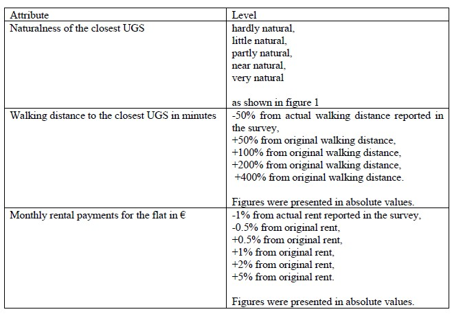
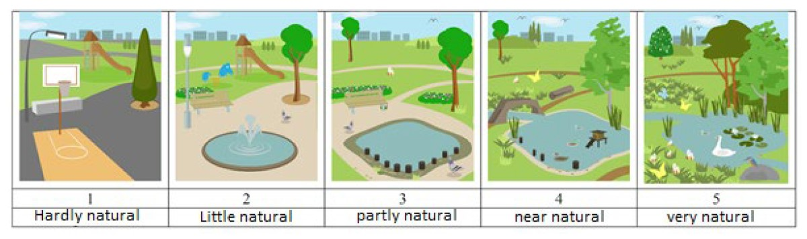

```{r, echo=FALSE, include=FALSE, eval=TRUE}
source("Code/start.R")
source("Code/datasetup.R")
source("Code/models.R")
source("Code/wtp.R")

```

## **1. Introduction**

Urban green spaces (UGS) have recently gained increasing attention as a
place for biodiversity conservation. Since they provide people with a
wide range of benefits, including health and recreation, demand appears
to be increasing for living close to an UGS according to a review of the *World
Health Organization* (@world2016urban). However, there is still
little extent to which people value the biodiversity and naturalness of
these spaces and are willing to pay for them. While previous studies
have used hedonistic pricing to determine the value of living near UGS
by examining the effects on housing prices, this analysis uses the
stated preference method. The method takes into account which
preferences people have according to their socio-economic status,
various amenities of their living status and general preferences.

To identify the preferences of people towards those non-market goods,
discrete choice experiments (DCEs) are a common tool to reveal the
determinants of people's behavior and for instance allow investigating the Willingness to Pay (WTP) for specific attributes (@lancsar2017discrete).

In the two periods from June 16, 2020 to June 29, 2020 as well as from
July 20, 2020 to July 28, 2020, an online survey was conducted by
@bronnmann2020value to investigate preferences for the access of UGS in Germany. A total of 1,570 people were surveyed, which are representatives of the country's population in terms of age, gender and income. It should be noted that the time frame was during the Covid-19 pandemic in Germany. The survey consists of questions on socio-economic factors, housing situation, perceptions of neighborhood biodiversity, immediate living situation, and the actual discrete choice experiment.
In the DCE, respondents have been asked to consider that the UGS most often used is going to be redesigned with regard to their naturalness and that the walking distance to the UGS will be altered by changes of roads or trails. The cost of the redesign is going to be billed through the monthly rental payment, which may result in additional costs or savings. In the DCE, participants have three choices
between two programs for remodeling their nearest UGS or the third program of keeping their current situation (further called status quo).

In this analysis, I would like to apply three different models, using
only parts of the data collected, as it would otherwise be out of scope.
First, the preference for naturalness as well as the walking distance of
these green spaces for the residents in relation to their rent will be
evaluated. Based thereon the second model evaluates whether there is a
correlation between walking distance and and the health and income of
the respondents. In the third model, I address the question if
owning a private green space such as a allotment, a balcony or a
regular garden has an impact on preferences for naturalness in the
neighborhood.

As an overarching research question, I aim to elicit under what circumstances respondents value the access to an UGS. To illuminate this question, additional explanatory variables were included, as described earlier.

## **2. Methods**

Many everyday decisions have direct and indirect impacts on the natural
environment and ecosystem services. Often, people benefit from ecosystem
services, meaning there is a direct link between ecosystem well-being
and health. However, many environmental goods and services are not
traded in markets because it is challenging to determine the direct
costs and benefits of these services. The stated preferences method is
one of many methods that allow measuring preferences and transform them
into monetary values like consumer surplus, compensating variation and
others. In the chosen survey, a DCE is conducted as one of several methods of stated preferences. The stated preferences methods, in contrast to the revealed preferences methods, are more suitable for valuing very specific goods which can be freely chosen.

In a DCE, the choice is isolated and the
researcher evaluates which type of good is chosen in contrast to the
continuous choice. In the case of the survey, the UGS are the selected good (@bronnmann2020value). This specific good
can be described by different attributes. In this case the attributes
are *naturalness* [Naturnähe], *walking distance* [Erreichbarkeit] and
*rent* [Miete] which represents the cost attribute. Each respondent is
faced with 10 choice sets which are randomly distributed. The first and
second program differ in the levels of naturalness, walking distance and
rent. An overview of the attribute levels is provided in Figure 1. Those
are compared to program 3 which is based on the previous answers of the
respondents in the survey. Respondents have been asked in advance about their
current living situation in relation to the attributes that form the
basis for option 3 in all choice sets. In order to evaluate the
stated preferences methods, it is necessary to state the maximization
problem of utility. The goal is to determine the choices which maximize the respondents utility and therefore indicate the preferences of the individuals which we are aim to discover. Only one option can be chosen.



[Figure by @bronnmann2020value]

### **2.1 Linear Utility Model**

To solve the maximization problem, it is required to use the indirect
utility function to maximize utility.

After simplifying the model, the indirect utility function can be
expressed as:

$$V(A_j, y-p_jc_j) = \beta_1*a_{jk} + ... + \beta_k*a_{jk}+\beta_c*c $$

Based on the assumption that people act rationally, the option with the
highest utility for the respondent would be chosen. However, the real
world and people's choices are not always fully rational, as people make
choices that are outliers and are sometimes made randomly or under
conditions unknown to the model. Therefore, a random component
$\epsilon$ is added to the model to show the effects that are not
observed by the researcher but are known to the Individual.

### **2.2 Random Utility Model**

The random utility model is a statistical framework for analyzing
human behavior in economics and market research. It assumes that the
choices made by people are influenced by both observable and
unobservable factors, such as preferences and attitudes, and that these
factors have a random component. The probability that the individual
chooses alternative x is the probability that the utility of alternative
x is greater than the utility of all other alternatives. The aim of the
modeling is to estimate the $\beta$ parameters.

The conditional logit model is a type of random utility model. It
assumes that the utility that a person derives from each choice
alternative is a random variable and that the probability of choosing an
alternative is proportional to the exponential value of its utility
relative to the utility of the other alternatives.

Thus, the underlying assumption of the conditional logit model is the
property of independence of irrelevant alternatives IAA. It states that
the effect of adding or removing an alternative on an individual's
choice probabilities depends only on the utilities of the alternatives
that are available for choice and not on the utilities of the
alternatives that are not available for choice. This assumption
simplifies the estimation of choice probabilities and makes the
conditional logit model manageable, but it is not always a realistic
representation of consumer behavior such as situations where unobserved
factors are correlated over time. Conditional logit can only represent systematic taste variation but not random taste heterogeneity.

Nevertheless the *conditional logit model* is chosen for this analysis
and estimated by using the *Maximum Likelihood Estimation* which
is a general statistical method for estimating parameters.

### **2.3 Model specifications**

With the UGS data set in mind, I defined three different models. Each
model differs by its utility function expressed by the three given
attributes being modeled variously each time.

The first chosen model serves as the baseline for the other models. It
contains three attributes called *Erreichbarkeit*, *Miete* and
*Naturnähe* where *Miete* is the monetary attribute. *Alt* represent the
Alternative Specific Constant and it's corresponding $\beta$ parameter. The $\beta$
parameters are indicating the variable effects on probabilities, which
are estimated statistically - they are not yet know.

$$U=\beta_0*Alt +\beta_1*Erreichbarkeit+\beta_2*Miete+\beta_3*Naturnähe+\epsilon$$

The second model extends the basic model in relation to the interaction
terms. I included the mean-centered variables (called MC) health
condition and income in correlation to the attribute *Erreichbarkeit*, which
indicates the walking distance to the closest UGS.

$$U=\beta_0*Alt +\beta_1*Erreichbarkeit+\beta_2*Miete+\beta_3*Naturnähe + $$
$$\beta_4*HealthMC*Erreichbarkeit+\beta_5*IncomeMC*Erreichbarkeit+\epsilon$$

The third model is similar to the second model, but contains other
interaction terms. According to the research question the variables
garden, allotment and balcony are similar in the expression of a private
recreational space and a possible substitute for a demand of naturalness
close to home (*Naturnähe*). I specifically did not include the variable
*GreenBackyard* because the backyard is often also a common area.

$$U=\beta_0*Alt +\beta_1*Erreichbarkeit+\beta_2*Miete+\beta_3*Naturnähe+\beta_4*Garden*Naturnähe+$$
$$\beta_5*Kleingarten*Naturnähe+\beta_6*Balcony*Naturnähe+\epsilon$$

### **2.4 Willingness to Pay**

Willingness to pay (WTP) is the maximum amount of money that a consumer
is willing to spend on a purchase of a good or service. Therefore the
WTP value is the marginal rate of substitution between an attribute and
the monetary attribute.

The general formula of the WTP is given by where $a_c$ is cost attribute
and $a_k$ the chosen attribute:

$$MWTP_k=-\frac{\frac{\partial V}{\partial a_k}}{\frac{\partial V}{\partial a_c}}$$

The approach supports the determination of a market value for certain
goods or attributes that do not have a directly accessible market value
such as the naturalness of the neighborhood. To take into account the
average willingness to pay, one must use a mean-centered variant of the
chosen variable used in the interaction term. In this case I chose the
utility function of model 2 to work with. The average Marginal
Willingness to Pay (MWTP) for the degree of naturalness is shown as:

$$MWTP_{Erreichbarkeit}=-\dfrac{\beta_1+\beta_4*HealthMC+\beta_5*IncomeMC}{\beta_2}$$

## **3. Results**

The results are obtained with the *Maximum Likelihood Estimation* (MLE) by
using the R software package "apollo". It's an approach to estimate
parameters by maximizing the likelihood of the data and is most useful
if the least square methods are not working properly. Maximum likelihood
is able to estimate several parameters and allows calculating the
standard error. MLE assumes that the data is identically distributed and
independent.

Table 1 presents the estimation results of the *Conditional Logit models*.

### **3.1 Results of model 1**

The basic model without any interactions shows the estimated
coefficients for *Naturnähe*, *Miete* and *Erreichbarkeit*. The $\beta$
values of alt1 and alt2 indicate the overall preferences for the three
alternatives in the choice sets.

The Alternative Specific Constant (ASC) parameters can be interpreted as
the change in the respondents' utility due to the decision in favor of
one of the different alternatives. Table 1 illustrates that respondents
prefer the current situation, as the $\beta$ estimates for the first two
alternatives are negative. In particular, respondents prefer alternative
2 over alternative 1. As also known from @meyerhoff2009status, choice
experiments tend to certain preference for the status quo. People may
prefer their starting position to a rethinking of other options that
bring different possibilities but also constraints. The estimates of the
ASCs are all statistically significant at a significance level of p \<
0.01. In general, if the p-value is less than a specified significance
level (usually 0.01 or 0.05), then the null hypothesis can be rejected
and the coefficient is considered statistically significant.

Looking at the estimates of the attributes, they are all statistically
significant at a significance level of p \< 0.01.
It should be considered that a statistically significant result does not
automatically mean that causality exists. It is possible, for example,
that the relationship is influenced by factors that are perhaps not part
of the chosen survey.

In general, the coefficients illustrate how one unit increase of the
attribute increases or decreases the overall utility of the subjects.
Therefore an increase in one level [out of five level from hardly
natural to very natural] of naturalness increases the utility of the
respondents by 0.532. An illustration of these levels of naturalness is
given in Figure 2 below. On average, a higher degree of naturalness of
the most commonly used UGS significantly positively influences people's
choice and utility. Thus, the respondents rate the naturalness
positively. In contrast the walking distance seems to have a slightly
negative effect by -0.024 on the overall utility. The five levels of
walking distance vary from -50% to +400% from original walking distance.
Only the first level decreases the walking distance. Therefore it is
reasonable that one level increase of walking distance decreases the
respondents overall utility. Subsequently an increase of rent decreases
the overall utility by -0.021 due to having less money at the monthly
disposal. This a quite rational correlation as the monetary attribute is
often negatively correlated.



[Figure by @bronnmann2020value]

### **3.2 Results of model 2**

In model 2, the socio-economic variables *IncomePresent* and
*HealthCondition* are included in the utility function as interaction
terms. This examined how income and health affect preferences for the
walking distance to the closest UGS. For this purpose, the data has been
cleaned and mean-centered in advance in order to calculate the WTP in a
later step.

An interaction term is the product of two or more predictor variables in
the model equation. The coefficient of an interaction term represents
the change in the response variable due to an one unit change in the
interaction term while all other variables held constant.

For the sake of interpretation it's important to look first at the
significance levels. The estimate of *IncomeMC* is highly significant
whereas *HealthMC* is not even statistically significant at the 5 %
level. Therefore the interaction term of *ErreichbarkeitxHealthMC* does not
provide a meaningful interpretation. It can only be noted that there is
no apparent link between the preferences for walking distance and the
health condition of the respondents.

The interaction term of *ErreichbarkeitxIncomeMC* shows a slightly
negative estimate. Therefore if the walking distance increases by one
level (that people have to walk longer to access the UGS) the
respondents gain a negative utility estimate in relation to their
income. To interpret the result, there is a slight negative correlation
between people who gain less income and an increase of walking distance.

### **3.3 Results of model 3**

In model 3, private substitutes for UGS are considered. It is examined
whether people with private recreational spaces such as a garden, a
balcony or a allotment derive less utility from public green spaces than people without.

For the *Garden*, *Balcony* and *Kleingarten* option, subjects only had
the option of choosing between yes and no. Due to this numerical
variable type, no mean-centering was performed in this case. It was
attempted, however it led to poor significance levels and outcomes. In
addition, other interaction terms were attempted, but all were discarded
because they distorted the result and led to many 'NaNs' or poor
significance levels. A short overview can be found in the appendix if required.

Yet two of the three interaction terms are not significant at a 5 %
level and therefore difficult to interpret. Hence, the interaction term
of *NaturnähexGarden* shows a positive correlation. So people with a
garden get a positive utility by owning a garden and of also having
access to a natural UGS. Despite the poor significance level, it shows
in theory that even people with a private recreational area still
benefit and prefer a high degree of naturalness of the UGS. Additionally
to support the initial observation, the interaction term
*NaturnähexKleingarten* shows a positive estimate as well. The
interesting observation of the allotment is the estimate which is
statistically significant on the 5 % confidence level if considered the standard error and not the robust standard error. Therefore people
who own a allotment also still gain a utility increase by an increase of
the naturalness of the UGS. Yet the interaction term *NaturnähexBalcony*
is not significant at a 5 % level but show a contradictory picture
compared to the two previous observations. People owning a balcony have
a negative correlation towards the attribute of naturalness. If
naturalness increases in one level those respondents get on average a
slightly negative utility change. Nevertheless, it makes more sense to
focus on the statistically significant estimate of the allocation.

For further research, it would be interesting to know whether people
prefer public UGS for all people in the city or UGS only for their
neighborhood or even only for their home community. Therefore one could
especially look at the variable of *GreenBackyard*. This should be
applied in a different model.

### **3.4 Results of MWTP**

A practical interpretation of the results of a discrete choice
experiment is the computation of the MWTP, whose derivation exemplified
for *Erreichbarkeit* was described in the previous section.

In this regard, Table 2 shows the MWTP for each attribute. Most MWTP
estimates for the attributes are significant at the 5% level except of
health condition. According to the previous findings, the respondents willingness to pay for a marginal increase in *Erreichbarkeit* is -1.21. The interpretation of the value is more relevant in terms of the general direction of the value rather than in exact monetary units. Yet people are willing to pay less for an increase of walking distance because of an disadvantage in reaching the closest UGS. In contrast, one could mention that people are probably more willing to pay for an UGS closer to home and therefore with less walking distance. 
Respondents' willingness to pay for a marginal increase in *Naturnähe* is 24,98 at a significance level of p\< 0.01.  It can be determined that there is a rather
high willingness to pay for an increase in one level of naturalness close to home.
Because the scale ranged from "hardly natural" to "very natural", it is
impossible to give an exact unit of naturalness. An extension could be
to convert the scale into a natural index for UGS as done in @bronnmann2020value. Because *IncomeMC* is a monetary variable as rent it is not sensible to interpret it.


## **4. Discussion and Conclusion**

In this statistical analysis, it got investigated how people value
different characteristics of the Urban Green Space (UGS). On the one
hand, it was revealed that the level of naturalness is very important to
the respondents. They are also willing to spend more monetary resources
on this attribute. On the other hand, if the walking distance of the UGS
increases, this has a negative impact on the utility and the probability
choosing a certain alternative. Accordingly if rent increases, the
utility also decreases.

Perhaps it could be interpreted that people with higher incomes can afford housing with closer and more natural UGS near their homes. In contrast, people with less financial resources can more comfortably afford housing in a neighborhood with
less access to UGS as the walking distance increases. The health
condition has no relevant influence on the preference of the level of
walking distance to the UGS according to the results based on the data set. That is surprising at some point because one could expect that people with a higher health condition value the walking distance to their nearest UGS more. People who own a private recreational space such as a garden or allotment still benefit and
prefer a natural UGS close to their homes. That shows that all people
can benefit from public recreational areas.

Generally, people with higher incomes have greater access to a garden or
an allotment, as they have more financial resources to spend on them.
Therefore, it should be the task of the city and the state to provide
many and high-quality UGS, especially in low-income areas as stated
above, as people have fewer opportunities to access private recreational
spaces. As @liu2021analysis notes in a case study of Chicago, equal
access to UGS is important for all people as it is key to achieving
better public health outcomes. UGS are thus an effective means of
redistributing wealth in cities and equalizing income and opportunity
inequalities. Above all, it is a task for urban development concepts to
take these findings into account and to actively anchor them in the
politicy making process.

As an outlook for an improvement of the underlying survey, I would like
to briefly note that in my opinion the walking distance steps are
constructed in a counterproductive way. It would be easier to interpret
the walking distance if the scale would lead to an improvement, i.e. the
distance would become shorter. In addition, it goes in both directions,
i.e. more and less distance, which makes it difficult to interpret.
Therefore it would be better if it only went up or down.

Secondly, the health status probably meant little, since the
participants had to assess it themselves, which may have led to many
people simply giving a medium value. Moreover, a health assessment is
very subjective for all people.


```{r, echo=FALSE, include=FALSE, results="asis"}
str(modelbasic)
modelbasic$estimate
```

```{r, echo=FALSE, include=FALSE, message=FALSE, warning=FALSE}
models_tex=list()

models_tex[["Basic Model"]] <- quicktexregapollo(modelbasic)
models_tex[["Model Inter Health and Income"]] <- quicktexregapollo(modelinter1)
models_tex[["Model Inter Garden"]] <- quicktexregapollo(modelinter2)

```

```{r, echo=FALSE, results="asis", include=TRUE}
texreg(models_tex, caption = "Estimated models" ,custom.model.names = c("Basic Model", "Model Interaction Health and Income" , "Model Interaction Garden"))
```

```{r, echo=FALSE, results="asis", include=TRUE}
models_tex <- quicktexregapollo(modelinter1,wtpest = allwtp)
texreg(models_tex, caption = "Willingness to pay", custom.model.names = "Model Interaction Health and Income")
```
